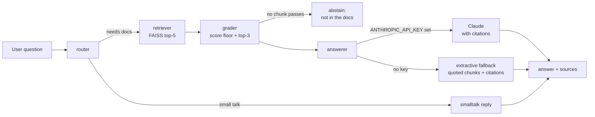

# Agentic RAG Assistant

A document Q&A agent over a company policy corpus. It combines **dense retrieval** (sentence-transformers + FAISS), a **LangGraph agent** (router → retriever → grader → answerer with citations), an **MCP server** exposing the retriever as a tool, and a **CLI + FastAPI** interface. Answers come from Claude when `ANTHROPIC_API_KEY` is set, otherwise from an extractive fallback that quotes retrieved chunks, so the project runs fully offline.

## Architecture



**Ingestion** (`ingest.py`): `data/` → sentence-aware chunking (500 chars, 80 overlap) → `all-MiniLM-L6-v2` embeddings → FAISS `IndexFlatIP` (exact cosine search) persisted in `index/`.

**MCP** (`mcp_server.py`): exposes `search_docs(query, k)` via the official `mcp` Python SDK (stdio transport), so Claude Desktop or any MCP client can use the retriever as a tool.

## Setup

```bash
git clone <this-repo> && cd agentic-rag-assistant
python -m venv .venv && source .venv/bin/activate
pip install -r requirements.txt
cp .env.example .env   # optional: add ANTHROPIC_API_KEY for Claude answers
python ingest.py       # builds the FAISS index (downloads the embedding model once)
```

## Usage

```bash
# CLI
python -m app.cli "How many days of annual leave do we get?"

# API
uvicorn app.api:app --reload
curl -X POST localhost:8000/ask -H "Content-Type: application/json" \
     -d '{"question": "What is the password policy?"}'

# MCP server (stdio)
python mcp_server.py

# Agent as a library
python agent.py "How do I set up the VPN?"
```

## Evaluation

`eval.py` runs 15 hand-written questions against the corpus and measures:

| Metric | What it means |
|---|---|
| recall@3 | fraction of gold documents found in the top-3 chunks |
| precision@3 | fraction of the top-3 chunks from a gold document |
| keyword recall | expected answer keywords present in the generated answer |
| faithfulness | answers where every sentence is grounded in retrieved chunks (or the agent honestly abstained); simple lexical proxy, not an LLM judge |

<!--EVAL_RESULTS-->
Measured on 2026-10-01 with `python eval.py` (extractive fallback mode, no API key):

| Metric | Score |
|---|---|
| recall@3 | 0.967 |
| precision@3 | 0.689 |
| keyword recall | 0.833 |
| faithfulness | 1.000 |
| abstentions | 0 / 15 |

Notes: recall@3 misses only on q06, where the question was labelled with two gold docs (phishing-response + incident-response) but is really answered by one. keyword recall is a strict substring check against the extractive quotes; with a Claude key set, the generator mode typically scores higher on completeness. Faithfulness is a lexical grounding proxy (see `eval.py`), not an LLM judge.

Run it yourself: `python eval.py` (needs the index built via `python ingest.py`).

## Tech stack

Python, sentence-transformers (`all-MiniLM-L6-v2`), FAISS, LangGraph, Anthropic Claude API, MCP Python SDK, FastAPI, pypdf, NumPy.

## What I learned / interview talking points

- **Why agentic RAG, not plain RAG:** the router skips retrieval for small talk, and the grader drops weak matches so the generator never sees off-topic context. When nothing passes grading, the agent abstains instead of hallucinating. That abstention behavior is a deliberate anti-hallucination design choice.
- **Chunking matters more than it looks:** sentence-boundary chunking with overlap keeps each chunk self-contained; a chunk cut mid-sentence retrieves worse and reads worse in citations.
- **Cosine via normalized vectors:** L2-normalising embeddings turns FAISS inner-product search into cosine search, which is length-invariant. Important because chunks vary in length.
- **Graceful degradation:** the extractive fallback means the system is fully usable with zero API cost. It cannot invent facts because it only quotes retrieved text.
- **Eval before claims:** every number in the table above was measured by running `eval.py`, not estimated. The faithfulness check is intentionally simple (token overlap); a stronger version would use an LLM judge or an NLI model.
- **Natural next steps:** hybrid (BM25 + dense) retrieval, a cross-encoder re-ranker, an LLM-as-judge grader, and streaming answers in the API.
